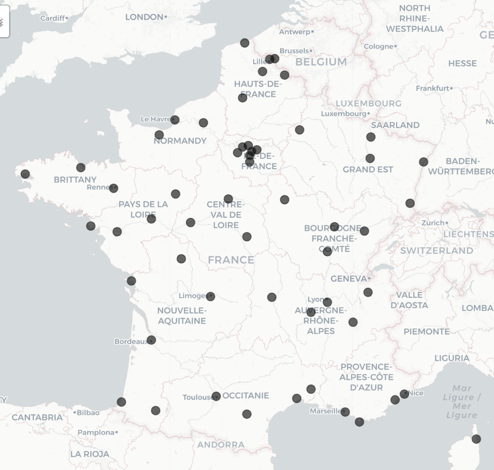

```{r setup, include=FALSE}
knitr::opts_chunk$set(echo = TRUE)
```

Régions classées par nombre d'habitant·es :

- [Ile de France (7 stations)](#ile-de-france-7-stations)

- [Auvergne-Rhône-Alpes (5 stations)](#auvergne-rhone-alpes-5-stations)

- [Hauts-de-France (5 stations)](#hauts-de-france-5-stations)

- [Nouvelle Aquitaine (6 stations)](#nouvelle-aquitaine-6-stations)

- [Occitanie (4 stations)](#occitanie-4-stations)

- [Grand-Est (5 stations)](#grand-est-5-stations)

- [Provence-Alpes-Côte d’Azur (4 stations)](#provence-alpes-cote-dazur-4-stations)

- [Pays de La Loire (4 stations)](#pays-de-la-loire-4-stations)

- [Normandie (3 stations)](#normandie-3-stations)

- [Bretagne (3 stations)](#bretagne-3-stations)

- [Bourgogne-Franche-Comté (4 stations)](#bourgogne-franche-comté-4-stations)

- [Centre-Val-de-Loire (3 stations)](#centre-val-de-loire-3-stations)

- [Corse (1 station)](#corse-1-station)

- [Sources et explications des calculs](#sources-et-explications-des-calculs)

> **Suivi du SARS-CoV-2 dans les eaux usées :** cette page t'aide à suivre les résurgences de covid et à évaluer les risques dans ta région.

__Comment lire ces graphiques ?__ Clique sur ta région dans le sommaire, et trouve la station la plus proche de ton lieu de vie. Ensuite, il y a deux choses à évaluer : 

1- Est-ce que le virus circule beaucoup ? (réponse : couleur des points & texte de résumé des niveaux COVID)

2- Est-ce que l'épidémie se répand (réponse : courbe qui monte) ou diminue (courbe qui descend) ?

Les conclusions données dans ce bulletin sont indicatives, elles ont 1 à 2 semaine de retard, et sont à combiner avec d'autres indicateurs de la circulation (ex. [rapports RELAB/RENAL du CNR](https://www.pasteur.fr/fr/sante-publique/tous-cnr/virus-infections-respiratoires-dont-grippe-sars-cov-2#Bulletin-national-hebdomadaire-surveillance-virus-respiratoires)) mais donnent cependant une bonne idée de la prise de risque et permettent de se préparer à réhausser sa vigilance (pour plus d'explications sur les calculs, voir [en fin de page](#sources-et-explications-des-calculs)).

Cette page peut ne pas être accessible aux lecteurs d'écran (pas de description des graphiques).


```{r, echo=FALSE, out.width="50%"}
#download latest data
sumeau <- read.csv("https://www.data.gouv.fr/fr/datasets/r/2963ccb5-344d-4978-bdd3-08aaf9efe514",
                   sep = ";", dec=",")

Regions <- read.csv2("~/Documents/R projects/R_covid_data/R_egouts/SumEau_Regions.csv")
A=c("nom", "sandre", "commune", "region")
Regions[A] <- lapply(Regions[A], as.factor)  
# sapply(Regions, class)

# create a color palette :
# cols = rev(brewer.pal(3, "PRGn")) #c("blue","orange","black")
cols = c("grey98","#ffd288" , "#ff885f")
palette(cols)

library(reshape2) #for the function melt()

```

---------------------

```{r, echo=FALSE, out.width="50%"}

molted1=melt(sumeau, id.vars=c("semaine"))
names(molted1)=c("semaine", "station", "value")

names(Regions)[1]="station"

# remove stations that are not used anymore
# Roubaix
molted1=molted1[!molted1$station=="ROUBAIX.WATTRELOS",]
Regions=Regions[!Regions$station=="ROUBAIX.WATTRELOS",]

# select only 1 region
Region1=Regions[Regions$region=="IDF",]

# add the commune
# sapply(molted1, class)
#create a variable for the order of molted1
molted1$id=1:nrow(molted1)

# merge data
MERGE=merge(molted1, Region1, by.x="station",
						by.y="station",
						all.x=FALSE, all.y=FALSE) # ONLY IDF

MERGE=MERGE[order(MERGE$id),] #reorder by ID
# head(MERGE); tail(MERGE)  # WORKS !!

# MERGE=molted1[molted1$station %in% Region1$station,] # only that region IDF
# ajouter les communes ?
# summary(droplevels(MERGE$station))

molted=droplevels(MERGE) # replace the dataset by smaller one
NBst = length(summary(as.factor(molted$station))) # number of station
```

## Ile de France (`r NBst` stations)

**Résumé des niveaux COVID** - Ces données présentent la surveillance du SARS-CoV-2 dans les eaux usées en Ile de France dans `r NBst` stations.

```{r, echo=FALSE, out.width="50%"}

newdataset <- lapply(c(1:NBst), function(i){ 
	dt=molted[molted$station==names(summary(as.factor(molted$station)))[i],]
	SUM=summary(dt$value)
	
	dt$riskestimate=dt$value # add a nez column
	# replace the risk estimate by 1/2/3
	dt[!is.na(dt$value) & dt$value>=SUM["3rd Qu."],]$riskestimate <- 3
	dt[!is.na(dt$value) &dt$value>SUM["1st Qu."]&dt$value<SUM["3rd Qu."],]$riskestimate <- 2
	dt[!is.na(dt$value) &dt$value<=SUM["1st Qu."],]$riskestimate <- 1
	dt_end=tail(dt, 1)
	#print(dt_end)
		if(is.na(dt_end$riskestimate)==TRUE) {print(paste(dt_end$commune, ": données manquantes pour cette semaine"))}
	if(isTRUE(dt_end$riskestimate == 1)==TRUE) {print(paste(dt_end$commune, ": ~ circulation relativement faible"))}
		if(isTRUE(dt_end$riskestimate == 2)==TRUE) {print(paste(dt_end$commune, ":  + circulation moyenne à forte"))}
	 		if(isTRUE(dt_end$riskestimate == 3)==TRUE) {print(paste(dt_end$commune, "+++++++ circulation très forte"))}
	})

```

**Graphiques par station :**

```{r, echo=FALSE, out.width="50%"}
#plot all the stations :
plotallstations <- lapply(c(1:NBst), function(i){
	dt=molted[molted$station==names(summary(as.factor(molted$station)))[i],]
	SUM=summary(dt$value)
	
	dt$riskestimate=dt$value # add a nez column
	# replace the risk estimate by 1/2/3
	dt[!is.na(dt$value) & dt$value>=SUM["3rd Qu."],]$riskestimate <- 3
	dt[!is.na(dt$value) &dt$value>SUM["1st Qu."]&dt$value<SUM["3rd Qu."],]$riskestimate <- 2
	dt[!is.na(dt$value) &dt$value<=SUM["1st Qu."],]$riskestimate <- 1
	dt=tail(dt, 30)
	
par(mar=c(4,5,2,1),
		yaxs="i")

dt$semaine1 = gsub("S","W", dt$semaine)
dt$semaine1 = paste(dt$semaine1, "-1", sep="")

plot(dt$value~ISOweek::ISOweek2date(dt$semaine1), 
		 pch=21, bg=as.factor(dt$riskestimate), type="b",
		 bty="l", xaxt="n",
		 cex=2, cex.lab=1.4, cex.axis=1.2,
		 ylim=c(0, max(dt$value, na.rm=T)+0.1*max(dt$value, na.rm=T)),
		 xlab="Semaines (2024-2025)", 
		 ylab = "Concentration relative en SARS-CoV-2",
		 main=paste(dt$commune[1], " (", gsub("\\."," ", dt$station[1]),")", sep=""))
axis(side=1, at=ISOweek::ISOweek2date(dt$semaine1),
		 gsub("2024|2025","",
		 				 gsub("-S","", dt$semaine)))
})

```

---------------------

```{r, echo=FALSE, out.width="50%"}
# select only 1 region
Region1=Regions[Regions$region=="ARA",]

MERGE=merge(molted1, Region1, by.x="station",
						by.y="station",
						all.x=FALSE, all.y=FALSE) # only that region

MERGE=MERGE[order(MERGE$id),] 

molted=droplevels(MERGE) # replace the dataset by smaller one
NBst = length(summary(as.factor(molted$station))) # number of station
```


## Auvergne-Rhône-Alpes (`r NBst` stations)

**Résumé des niveaux COVID** - Ces données présentent la surveillance du SARS-CoV-2 en Auvergne-Rhône-Alpes dans les eaux usées dans **`r NBst` stations**.

```{r, echo=FALSE, out.width="50%"}

newdataset <- lapply(c(1:NBst), function(i){ 
	dt=molted[molted$station==names(summary(as.factor(molted$station)))[i],]
	SUM=summary(dt$value)
	
	dt$riskestimate=dt$value # add a nez column
	# replace the risk estimate by 1/2/3
	dt[!is.na(dt$value) & dt$value>=SUM["3rd Qu."],]$riskestimate <- 3
	dt[!is.na(dt$value) &dt$value>SUM["1st Qu."]&dt$value<SUM["3rd Qu."],]$riskestimate <- 2
	dt[!is.na(dt$value) &dt$value<=SUM["1st Qu."],]$riskestimate <- 1
	dt_end=tail(dt, 1)
	#print(dt_end)
		if(is.na(dt_end$riskestimate)==TRUE) {print(paste(dt_end$commune, ": données manquantes pour cette semaine"))}
	if(isTRUE(dt_end$riskestimate == 1)==TRUE) {print(paste(dt_end$commune, ": ~ circulation relativement faible"))}
		if(isTRUE(dt_end$riskestimate == 2)==TRUE) {print(paste(dt_end$commune, ":  + circulation moyenne à forte"))}
	 		if(isTRUE(dt_end$riskestimate == 3)==TRUE) {print(paste(dt_end$commune, "+++++++ circulation très forte "))}
	})

```

**Graphiques par station :**

```{r, echo=FALSE, out.width="50%"}
#plot all the stations :
plotallstations <- lapply(c(1:NBst), function(i){
	dt=molted[molted$station==names(summary(as.factor(molted$station)))[i],]
	SUM=summary(dt$value)
	
	dt$riskestimate=dt$value # add a nez column
	# replace the risk estimate by 1/2/3
	dt[!is.na(dt$value) & dt$value>=SUM["3rd Qu."],]$riskestimate <- 3
	dt[!is.na(dt$value) &dt$value>SUM["1st Qu."]&dt$value<SUM["3rd Qu."],]$riskestimate <- 2
	dt[!is.na(dt$value) &dt$value<=SUM["1st Qu."],]$riskestimate <- 1
	dt=tail(dt, 30)
	
par(mar=c(4,5,2,1),
		yaxs="i")

dt$semaine1 = gsub("S","W", dt$semaine)
dt$semaine1 = paste(dt$semaine1, "-1", sep="")

plot(dt$value~ISOweek::ISOweek2date(dt$semaine1), 
		 pch=21, bg=as.factor(dt$riskestimate), type="b",
		 bty="l", xaxt="n",
		 cex=2, cex.lab=1.4, cex.axis=1.2,
		 ylim=c(0, max(dt$value, na.rm=T)+0.1*max(dt$value, na.rm=T)),
		 xlab="Semaines (2024-2025)", 
		 ylab = "Concentration relative en SARS-CoV-2",
		 main=paste(dt$commune[1], " (", gsub("\\."," ", dt$station[1]),")", sep=""))
axis(side=1, at=ISOweek::ISOweek2date(dt$semaine1),
		 gsub("2024|2025","",
		 				 gsub("-S","", dt$semaine)))
})

```

---------------------

```{r, echo=FALSE, out.width="50%"}
# select only 1 region
Region1=Regions[Regions$region=="HDF",]

# merge data 
MERGE=merge(molted1, Region1, by.x="station",
						by.y="station",all.x=FALSE, all.y=FALSE)
MERGE=MERGE[order(MERGE$id),] # only that region

molted=droplevels(MERGE) # replace the dataset by smaller one
NBst = length(summary(as.factor(molted$station))) # number of station
```


## Hauts-de-France (`r NBst` stations)

**Résumé des niveaux COVID** - Ces données présentent la surveillance du SARS-CoV-2 dans les eaux usées dans les Hauts-de-France dans **`r NBst` stations**.

```{r, echo=FALSE, out.width="50%"}

newdataset <- lapply(c(1:NBst), function(i){ 
	dt=molted[molted$station==names(summary(as.factor(molted$station)))[i],]
	SUM=summary(dt$value)
	
	dt$riskestimate=dt$value # add a nez column
	# replace the risk estimate by 1/2/3
	dt[!is.na(dt$value) & dt$value>=SUM["3rd Qu."],]$riskestimate <- 3
	dt[!is.na(dt$value) &dt$value>SUM["1st Qu."]&dt$value<SUM["3rd Qu."],]$riskestimate <- 2
	dt[!is.na(dt$value) &dt$value<=SUM["1st Qu."],]$riskestimate <- 1
	dt_end=tail(dt, 1)
	#print(dt_end)
		if(is.na(dt_end$riskestimate)==TRUE) {print(paste(dt_end$commune, ": données manquantes pour cette semaine"))}
	if(isTRUE(dt_end$riskestimate == 1)==TRUE) {print(paste(dt_end$commune, ": ~ circulation relativement faible"))}
		if(isTRUE(dt_end$riskestimate == 2)==TRUE) {print(paste(dt_end$commune, ":  + circulation moyenne à forte"))}
	 		if(isTRUE(dt_end$riskestimate == 3)==TRUE) {print(paste(dt_end$commune, "+++++++ circulation très forte "))}
	})

```

**Graphiques par station :**

```{r, echo=FALSE, out.width="50%"}
#plot all the stations :
plotallstations <- lapply(c(1:NBst), function(i){
	dt=molted[molted$station==names(summary(as.factor(molted$station)))[i],]
	SUM=summary(dt$value)
	
	dt$riskestimate=dt$value # add a nez column
	# replace the risk estimate by 1/2/3
	dt[!is.na(dt$value) & dt$value>=SUM["3rd Qu."],]$riskestimate <- 3
	dt[!is.na(dt$value) &dt$value>SUM["1st Qu."]&dt$value<SUM["3rd Qu."],]$riskestimate <- 2
	dt[!is.na(dt$value) &dt$value<=SUM["1st Qu."],]$riskestimate <- 1
	dt=tail(dt, 30)
	
par(mar=c(4,5,2,1),
		yaxs="i")

dt$semaine1 = gsub("S","W", dt$semaine)
dt$semaine1 = paste(dt$semaine1, "-1", sep="")

plot(dt$value~ISOweek::ISOweek2date(dt$semaine1), 
		 pch=21, bg=as.factor(dt$riskestimate), type="b",
		 bty="l", xaxt="n",
		 cex=2, cex.lab=1.4, cex.axis=1.2,
		 ylim=c(0, max(dt$value, na.rm=T)+0.1*max(dt$value, na.rm=T)),
		 xlab="Semaines (2024-2025)", 
		 ylab = "Concentration relative en SARS-CoV-2",
		 main=paste(dt$commune[1], " (", gsub("\\."," ", dt$station[1]),")", sep=""))
axis(side=1, at=ISOweek::ISOweek2date(dt$semaine1),
		 gsub("2024|2025","",
		 				 gsub("-S","", dt$semaine)))
})

```

---------------------

```{r, echo=FALSE, out.width="50%"}
# select only 1 region
Region1=Regions[Regions$region=="NAQ",]

# merge data 
MERGE=merge(molted1, Region1, by.x="station",
						by.y="station", all.x=FALSE, all.y=FALSE) 

MERGE=MERGE[order(MERGE$id),]# only that region

molted=droplevels(MERGE) # replace the dataset by smaller one
NBst = length(summary(as.factor(molted$station))) # number of station
```

## Nouvelle Aquitaine (`r NBst` stations)

**Résumé des niveaux COVID** - Ces données présentent la surveillance du SARS-CoV-2 dans les eaux usées en Nouvelle Aquitaine dans **`r NBst` stations**.

```{r, echo=FALSE, out.width="50%"}

newdataset <- lapply(c(1:NBst), function(i){ 
	dt=molted[molted$station==names(summary(as.factor(molted$station)))[i],]
	SUM=summary(dt$value)
	
	dt$riskestimate=dt$value # add a nez column
	# replace the risk estimate by 1/2/3
	dt[!is.na(dt$value) & dt$value>=SUM["3rd Qu."],]$riskestimate <- 3
	dt[!is.na(dt$value) &dt$value>SUM["1st Qu."]&dt$value<SUM["3rd Qu."],]$riskestimate <- 2
	dt[!is.na(dt$value) &dt$value<=SUM["1st Qu."],]$riskestimate <- 1
	dt_end=tail(dt, 1)
	#print(dt_end)
		if(is.na(dt_end$riskestimate)==TRUE) {print(paste(dt_end$commune, ": données manquantes pour cette semaine"))}
	if(isTRUE(dt_end$riskestimate == 1)==TRUE) {print(paste(dt_end$commune, ": ~ circulation relativement faible"))}
		if(isTRUE(dt_end$riskestimate == 2)==TRUE) {print(paste(dt_end$commune, ":  + circulation moyenne à forte"))}
	 		if(isTRUE(dt_end$riskestimate == 3)==TRUE) {print(paste(dt_end$commune, "+++++++ circulation très forte "))}
	})

```

**Graphiques par station :**

```{r, echo=FALSE, out.width="50%"}
#plot all the stations :
plotallstations <- lapply(c(1:NBst), function(i){
	dt=molted[molted$station==names(summary(as.factor(molted$station)))[i],]
	SUM=summary(dt$value)
	
	dt$riskestimate=dt$value # add a nez column
	# replace the risk estimate by 1/2/3
	dt[!is.na(dt$value) & dt$value>=SUM["3rd Qu."],]$riskestimate <- 3
	dt[!is.na(dt$value) &dt$value>SUM["1st Qu."]&dt$value<SUM["3rd Qu."],]$riskestimate <- 2
	dt[!is.na(dt$value) &dt$value<=SUM["1st Qu."],]$riskestimate <- 1
	dt=tail(dt, 30)
	
par(mar=c(4,5,2,1),
		yaxs="i")

dt$semaine1 = gsub("S","W", dt$semaine)
dt$semaine1 = paste(dt$semaine1, "-1", sep="")

plot(dt$value~ISOweek::ISOweek2date(dt$semaine1), 
		 pch=21, bg=as.factor(dt$riskestimate), type="b",
		 bty="l", xaxt="n",
		 cex=2, cex.lab=1.4, cex.axis=1.2,
		 ylim=c(0, max(dt$value, na.rm=T)+0.1*max(dt$value, na.rm=T)),
		 xlab="Semaines (2024-2025)", 
		 ylab = "Concentration relative en SARS-CoV-2",
		 main=paste(dt$commune[1], " (", gsub("\\."," ", dt$station[1]),")", sep=""))
axis(side=1, at=ISOweek::ISOweek2date(dt$semaine1),
		 gsub("2024|2025","",
		 				 gsub("-S","", dt$semaine)))
})

```


---------------------


```{r, echo=FALSE, out.width="50%"}
# select only 1 region
Region1=Regions[Regions$region=="OCC",]

# merge data 
MERGE=merge(molted1, Region1, by.x="station", by.y="station", 
						all.x=FALSE, all.y=FALSE)

MERGE=MERGE[order(MERGE$id),]# only that region

molted=droplevels(MERGE) # replace the dataset by smaller one
NBst = length(summary(as.factor(molted$station))) # number of station
```

## Occitanie (`r NBst` stations)

**Résumé des niveaux COVID** - Ces données présentent la surveillance du SARS-CoV-2 dans les eaux usées en Occitanie dans **`r NBst` stations**.

```{r, echo=FALSE, out.width="50%"}

newdataset <- lapply(c(1:NBst), function(i){ 
	dt=molted[molted$station==names(summary(as.factor(molted$station)))[i],]
	SUM=summary(dt$value)
	
	dt$riskestimate=dt$value # add a nez column
	# replace the risk estimate by 1/2/3
	dt[!is.na(dt$value) & dt$value>=SUM["3rd Qu."],]$riskestimate <- 3
	dt[!is.na(dt$value) &dt$value>SUM["1st Qu."]&dt$value<SUM["3rd Qu."],]$riskestimate <- 2
	dt[!is.na(dt$value) &dt$value<=SUM["1st Qu."],]$riskestimate <- 1
	dt_end=tail(dt, 1)
	#print(dt_end)
		if(is.na(dt_end$riskestimate)==TRUE) {print(paste(dt_end$commune, ": données manquantes pour cette semaine"))}
	if(isTRUE(dt_end$riskestimate == 1)==TRUE) {print(paste(dt_end$commune, ": ~ circulation relativement faible"))}
		if(isTRUE(dt_end$riskestimate == 2)==TRUE) {print(paste(dt_end$commune, ":  + circulation moyenne à forte"))}
	 		if(isTRUE(dt_end$riskestimate == 3)==TRUE) {print(paste(dt_end$commune, "+++++++ circulation très forte "))}
	})

```

**Graphiques par station :**

```{r, echo=FALSE, out.width="50%"}
#plot all the stations :
plotallstations <- lapply(c(1:NBst), function(i){
	dt=molted[molted$station==names(summary(as.factor(molted$station)))[i],]
	SUM=summary(dt$value)
	
	dt$riskestimate=dt$value # add a nez column
	# replace the risk estimate by 1/2/3
	dt[!is.na(dt$value) & dt$value>=SUM["3rd Qu."],]$riskestimate <- 3
	dt[!is.na(dt$value) &dt$value>SUM["1st Qu."]&dt$value<SUM["3rd Qu."],]$riskestimate <- 2
	dt[!is.na(dt$value) &dt$value<=SUM["1st Qu."],]$riskestimate <- 1
	dt=tail(dt, 30)
	
par(mar=c(4,5,2,1),
		yaxs="i")

dt$semaine1 = gsub("S","W", dt$semaine)
dt$semaine1 = paste(dt$semaine1, "-1", sep="")

plot(dt$value~ISOweek::ISOweek2date(dt$semaine1), 
		 pch=21, bg=as.factor(dt$riskestimate), type="b",
		 bty="l", xaxt="n",
		 cex=2, cex.lab=1.4, cex.axis=1.2,
		 ylim=c(0, max(dt$value, na.rm=T)+0.1*max(dt$value, na.rm=T)),
		 xlab="Semaines (2024-2025)", 
		 ylab = "Concentration relative en SARS-CoV-2",
		 main=paste(dt$commune[1], " (", gsub("\\."," ", dt$station[1]),")", sep=""))
axis(side=1, at=ISOweek::ISOweek2date(dt$semaine1),
		 gsub("2024|2025","",
		 				 gsub("-S","", dt$semaine)))
})

```

---------------------

```{r, echo=FALSE, out.width="50%"}
# select only 1 region
Region1=Regions[Regions$region=="GES",]

# merge data 
MERGE=merge(molted1, Region1, by.x="station", by.y="station",
						all.x=FALSE, all.y=FALSE)

MERGE=MERGE[order(MERGE$id),]# only that region

molted=droplevels(MERGE) # replace the dataset by smaller one
NBst = length(summary(as.factor(molted$station))) # number of station
```

## Grand-Est (`r NBst` stations)

**Résumé des niveaux COVID** - Ces données présentent la surveillance du SARS-CoV-2 en Grand-Est dans les eaux usées dans **`r NBst` station**.


```{r, echo=FALSE, out.width="50%"}
newdataset <- lapply(c(1:NBst), function(i){ 
	dt=molted[molted$station==names(summary(as.factor(molted$station)))[i],]
	SUM=summary(dt$value)
	
	dt$riskestimate=dt$value # add a nez column
	# replace the risk estimate by 1/2/3
	dt[!is.na(dt$value) & dt$value>=SUM["3rd Qu."],]$riskestimate <- 3
	dt[!is.na(dt$value) &dt$value>SUM["1st Qu."]&dt$value<SUM["3rd Qu."],]$riskestimate <- 2
	dt[!is.na(dt$value) &dt$value<=SUM["1st Qu."],]$riskestimate <- 1
	dt_end=tail(dt, 1)
	#print(dt_end)
		if(is.na(dt_end$riskestimate)==TRUE) {print(paste(dt_end$commune, ": données manquantes pour cette semaine"))}
	if(isTRUE(dt_end$riskestimate == 1)==TRUE) {print(paste(dt_end$commune, ": ~ circulation relativement faible"))}
		if(isTRUE(dt_end$riskestimate == 2)==TRUE) {print(paste(dt_end$commune, ":  + circulation moyenne à forte"))}
	 		if(isTRUE(dt_end$riskestimate == 3)==TRUE) {print(paste(dt_end$commune, "+++++++ circulation très forte "))}
	})

```

**Graphiques par station :**

```{r, echo=FALSE, out.width="50%"}
#plot all the stations :
plotallstations <- lapply(c(1:NBst), function(i){
	dt=molted[molted$station==names(summary(as.factor(molted$station)))[i],]
	SUM=summary(dt$value)
	
	dt$riskestimate=dt$value # add a nez column
	# replace the risk estimate by 1/2/3
	dt[!is.na(dt$value) & dt$value>=SUM["3rd Qu."],]$riskestimate <- 3
	dt[!is.na(dt$value) &dt$value>SUM["1st Qu."]&dt$value<SUM["3rd Qu."],]$riskestimate <- 2
	dt[!is.na(dt$value) &dt$value<=SUM["1st Qu."],]$riskestimate <- 1
	dt=tail(dt, 30)
	
par(mar=c(4,5,2,1),
		yaxs="i")

dt$semaine1 = gsub("S","W", dt$semaine)
dt$semaine1 = paste(dt$semaine1, "-1", sep="")

plot(dt$value~ISOweek::ISOweek2date(dt$semaine1), 
		 pch=21, bg=as.factor(dt$riskestimate), type="b",
		 bty="l", xaxt="n",
		 cex=2, cex.lab=1.4, cex.axis=1.2,
		 ylim=c(0, max(dt$value, na.rm=T)+0.1*max(dt$value, na.rm=T)),
		 xlab="Semaines (2024-2025)", 
		 ylab = "Concentration relative en SARS-CoV-2",
		 main=paste(dt$commune[1], " (", gsub("\\."," ", dt$station[1]),")", sep=""))
axis(side=1, at=ISOweek::ISOweek2date(dt$semaine1),
		 gsub("2024|2025","",
		 				 gsub("-S","", dt$semaine)))
})

```

---------------------


```{r, echo=FALSE, out.width="50%"}
# select only 1 region
Region1=Regions[Regions$region=="PAC",]

# merge data 
MERGE=merge(molted1, Region1, by.x="station", 					
						by.y="station", 
						all.x=FALSE, all.y=FALSE)

MERGE=MERGE[order(MERGE$id),]# only that region

molted=droplevels(MERGE) # replace the dataset by smaller one
NBst = length(summary(as.factor(molted$station))) # number of station
```


## Provence-Alpes-Côte d'Azur (`r NBst` stations)

**Résumé des niveaux COVID** - Ces données présentent la surveillance du SARS-CoV-2 en Provence Alpes Côte d'Azur dans les eaux usées dans **`r NBst` station**.

```{r, echo=FALSE, out.width="50%"}
newdataset <- lapply(c(1:NBst), function(i){ 
	dt=molted[molted$station==names(summary(as.factor(molted$station)))[i],]
	SUM=summary(dt$value)
	
	dt$riskestimate=dt$value # add a nez column
	# replace the risk estimate by 1/2/3
	dt[!is.na(dt$value) & dt$value>=SUM["3rd Qu."],]$riskestimate <- 3
	dt[!is.na(dt$value) &dt$value>SUM["1st Qu."]&dt$value<SUM["3rd Qu."],]$riskestimate <- 2
	dt[!is.na(dt$value) &dt$value<=SUM["1st Qu."],]$riskestimate <- 1
	dt_end=tail(dt, 1)
	#print(dt_end)
		if(is.na(dt_end$riskestimate)==TRUE) {print(paste(dt_end$commune, ": données manquantes pour cette semaine"))}
	if(isTRUE(dt_end$riskestimate == 1)==TRUE) {print(paste(dt_end$commune, ": ~ circulation relativement faible"))}
		if(isTRUE(dt_end$riskestimate == 2)==TRUE) {print(paste(dt_end$commune, ":  + circulation moyenne à forte"))}
	 		if(isTRUE(dt_end$riskestimate == 3)==TRUE) {print(paste(dt_end$commune, "+++++++ circulation très forte "))}
	})

```

**Graphiques par station :**

```{r, echo=FALSE, out.width="50%"}
#plot all the stations :
plotallstations <- lapply(c(1:NBst), function(i){
	dt=molted[molted$station==names(summary(as.factor(molted$station)))[i],]
	SUM=summary(dt$value)
	
	dt$riskestimate=dt$value # add a nez column
	# replace the risk estimate by 1/2/3
	dt[!is.na(dt$value) & dt$value>=SUM["3rd Qu."],]$riskestimate <- 3
	dt[!is.na(dt$value) &dt$value>SUM["1st Qu."]&dt$value<SUM["3rd Qu."],]$riskestimate <- 2
	dt[!is.na(dt$value) &dt$value<=SUM["1st Qu."],]$riskestimate <- 1
	dt=tail(dt, 30)
	
par(mar=c(4,5,2,1),
		yaxs="i")

dt$semaine1 = gsub("S","W", dt$semaine)
dt$semaine1 = paste(dt$semaine1, "-1", sep="")

plot(dt$value~ISOweek::ISOweek2date(dt$semaine1), 
		 pch=21, bg=as.factor(dt$riskestimate), type="b",
		 bty="l", xaxt="n",
		 cex=2, cex.lab=1.4, cex.axis=1.2,
		 ylim=c(0, max(dt$value, na.rm=T)+0.1*max(dt$value, na.rm=T)),
		 xlab="Semaines (2024-2025)", 
		 ylab = "Concentration relative en SARS-CoV-2",
		 main=paste(dt$commune[1], " (", gsub("\\."," ", dt$station[1]),")", sep=""))
axis(side=1, at=ISOweek::ISOweek2date(dt$semaine1),
		 gsub("2024|2025","",
		 				 gsub("-S","", dt$semaine)))
})

```


---------------------


```{r, echo=FALSE, out.width="50%"}
# select only 1 region
Region1=Regions[Regions$region=="PDL",]

# merge data 
MERGE=merge(molted1, Region1, by.x="station", by.y="station", 
						all.x=FALSE, all.y=FALSE) 

MERGE=MERGE[order(MERGE$id),] # only that region

molted=droplevels(MERGE) # replace the dataset by smaller one
NBst = length(summary(as.factor(molted$station))) # number of station
```

## Pays de La Loire (`r NBst` stations)

**Résumé des niveaux COVID** - Ces données présentent la surveillance du SARS-CoV-2 en Pays de La Loire dans les eaux usées dans **`r NBst` station**.

```{r, echo=FALSE, out.width="50%"}
newdataset <- lapply(c(1:NBst), function(i){ 
	dt=molted[molted$station==names(summary(as.factor(molted$station)))[i],]
	SUM=summary(dt$value)
	
	dt$riskestimate=dt$value # add a nez column
	# replace the risk estimate by 1/2/3
	dt[!is.na(dt$value) & dt$value>=SUM["3rd Qu."],]$riskestimate <- 3
	dt[!is.na(dt$value) &dt$value>SUM["1st Qu."]&dt$value<SUM["3rd Qu."],]$riskestimate <- 2
	dt[!is.na(dt$value) &dt$value<=SUM["1st Qu."],]$riskestimate <- 1
	dt_end=tail(dt, 1)
	#print(dt_end)
		if(is.na(dt_end$riskestimate)==TRUE) {print(paste(dt_end$commune, ": données manquantes pour cette semaine"))}
	if(isTRUE(dt_end$riskestimate == 1)==TRUE) {print(paste(dt_end$commune, ": ~ circulation relativement faible"))}
		if(isTRUE(dt_end$riskestimate == 2)==TRUE) {print(paste(dt_end$commune, ":  + circulation moyenne à forte"))}
	 		if(isTRUE(dt_end$riskestimate == 3)==TRUE) {print(paste(dt_end$commune, "+++++++ circulation très forte "))}
	})

```

**Graphiques par station :**

```{r, echo=FALSE, out.width="50%"}
#plot all the stations :
plotallstations <- lapply(c(1:NBst), function(i){
	dt=molted[molted$station==names(summary(as.factor(molted$station)))[i],]
	SUM=summary(dt$value)
	
	dt$riskestimate=dt$value # add a nez column
	# replace the risk estimate by 1/2/3
	dt[!is.na(dt$value) & dt$value>=SUM["3rd Qu."],]$riskestimate <- 3
	dt[!is.na(dt$value) &dt$value>SUM["1st Qu."]&dt$value<SUM["3rd Qu."],]$riskestimate <- 2
	dt[!is.na(dt$value) &dt$value<=SUM["1st Qu."],]$riskestimate <- 1
	dt=tail(dt, 30)
	
par(mar=c(4,5,2,1),
		yaxs="i")

dt$semaine1 = gsub("S","W", dt$semaine)
dt$semaine1 = paste(dt$semaine1, "-1", sep="")

plot(dt$value~ISOweek::ISOweek2date(dt$semaine1), 
		 pch=21, bg=as.factor(dt$riskestimate), type="b",
		 bty="l", xaxt="n",
		 cex=2, cex.lab=1.4, cex.axis=1.2,
		 ylim=c(0, max(dt$value, na.rm=T)+0.1*max(dt$value, na.rm=T)),
		 xlab="Semaines (2024-2025)", 
		 ylab = "Concentration relative en SARS-CoV-2",
		 main=paste(dt$commune[1], " (", gsub("\\."," ", dt$station[1]),")", sep=""))
axis(side=1, at=ISOweek::ISOweek2date(dt$semaine1),
		 gsub("2024|2025","",
		 				 gsub("-S","", dt$semaine)))
})

```


---------------------


```{r, echo=FALSE, out.width="50%"}
# select only 1 region
Region1=Regions[Regions$region=="NOR",]

# merge data 
MERGE=merge(molted1, Region1, by.x="station", by.y="station", 
						all.x=FALSE, all.y=FALSE) 

MERGE=MERGE[order(MERGE$id),] # only that region

molted=droplevels(MERGE) # replace the dataset by smaller one
NBst = length(summary(as.factor(molted$station))) # number of station
```


## Normandie (`r NBst` stations)

**Résumé des niveaux COVID** - Ces données présentent la surveillance du SARS-CoV-2 en Normandie dans les eaux usées dans **`r NBst` stations**.

```{r, echo=FALSE, out.width="50%"}

newdataset <- lapply(c(1:NBst), function(i){ 
	dt=molted[molted$station==names(summary(as.factor(molted$station)))[i],]
	SUM=summary(dt$value)
	
	dt$riskestimate=dt$value # add a nez column
	# replace the risk estimate by 1/2/3
	dt[!is.na(dt$value) & dt$value>=SUM["3rd Qu."],]$riskestimate <- 3
	dt[!is.na(dt$value) &dt$value>SUM["1st Qu."]&dt$value<SUM["3rd Qu."],]$riskestimate <- 2
	dt[!is.na(dt$value) &dt$value<=SUM["1st Qu."],]$riskestimate <- 1
	dt_end=tail(dt, 1)
	#print(dt_end)
		if(is.na(dt_end$riskestimate)==TRUE) {print(paste(dt_end$commune, ": données manquantes pour cette semaine"))}
	if(isTRUE(dt_end$riskestimate == 1)==TRUE) {print(paste(dt_end$commune, ": ~ circulation relativement faible"))}
		if(isTRUE(dt_end$riskestimate == 2)==TRUE) {print(paste(dt_end$commune, ":  + circulation moyenne à forte"))}
	 		if(isTRUE(dt_end$riskestimate == 3)==TRUE) {print(paste(dt_end$commune, "+++++++ circulation très forte "))}
	})

```

**Graphiques par station :**

```{r, echo=FALSE, out.width="50%"}
#plot all the stations :
plotallstations <- lapply(c(1:NBst), function(i){
	dt=molted[molted$station==names(summary(as.factor(molted$station)))[i],]
	SUM=summary(dt$value)
	
	dt$riskestimate=dt$value # add a nez column
	# replace the risk estimate by 1/2/3
	dt[!is.na(dt$value) & dt$value>=SUM["3rd Qu."],]$riskestimate <- 3
	dt[!is.na(dt$value) &dt$value>SUM["1st Qu."]&dt$value<SUM["3rd Qu."],]$riskestimate <- 2
	dt[!is.na(dt$value) &dt$value<=SUM["1st Qu."],]$riskestimate <- 1
	dt=tail(dt, 30)
	
par(mar=c(4,5,2,1),
		yaxs="i")

dt$semaine1 = gsub("S","W", dt$semaine)
dt$semaine1 = paste(dt$semaine1, "-1", sep="")

plot(dt$value~ISOweek::ISOweek2date(dt$semaine1), 
		 pch=21, bg=as.factor(dt$riskestimate), type="b",
		 bty="l", xaxt="n",
		 cex=2, cex.lab=1.4, cex.axis=1.2,
		 ylim=c(0, max(dt$value, na.rm=T)+0.1*max(dt$value, na.rm=T)),
		 xlab="Semaines (2024-2025)", 
		 ylab = "Concentration relative en SARS-CoV-2",
		 main=paste(dt$commune[1], " (", gsub("\\."," ", dt$station[1]),")", sep=""))
axis(side=1, at=ISOweek::ISOweek2date(dt$semaine1),
		 gsub("2024|2025","",
		 				 gsub("-S","", dt$semaine)))
})

```


---------------------


```{r, echo=FALSE, out.width="50%"}
# select only 1 region
Region1=Regions[Regions$region=="BRE",]

# merge data 
MERGE=merge(molted1, Region1, by.x="station", by.y="station", 
						all.x=FALSE, all.y=FALSE) 

MERGE=MERGE[order(MERGE$id),] # only that region

molted=droplevels(MERGE) # replace the dataset by smaller one
NBst = length(summary(as.factor(molted$station))) # number of station
```


## Bretagne (`r NBst` stations)

**Résumé des niveaux COVID** - Ces données présentent la surveillance du SARS-CoV-2 en Bretagne dans les eaux usées dans **`r NBst` stations**.

```{r, echo=FALSE, out.width="50%"}
newdataset <- lapply(c(1:NBst), function(i){ 
	dt=molted[molted$station==names(summary(as.factor(molted$station)))[i],]
	SUM=summary(dt$value)
	
	dt$riskestimate=dt$value # add a nez column
	# replace the risk estimate by 1/2/3
	dt[!is.na(dt$value) & dt$value>=SUM["3rd Qu."],]$riskestimate <- 3
	dt[!is.na(dt$value) &dt$value>SUM["1st Qu."]&dt$value<SUM["3rd Qu."],]$riskestimate <- 2
	dt[!is.na(dt$value) &dt$value<=SUM["1st Qu."],]$riskestimate <- 1
	dt_end=tail(dt, 1)
	#print(dt_end)
		if(is.na(dt_end$riskestimate)==TRUE) {print(paste(dt_end$commune, ": données manquantes pour cette semaine"))}
	if(isTRUE(dt_end$riskestimate == 1)==TRUE) {print(paste(dt_end$commune, ": ~ circulation relativement faible"))}
		if(isTRUE(dt_end$riskestimate == 2)==TRUE) {print(paste(dt_end$commune, ":  + circulation moyenne à forte"))}
	 		if(isTRUE(dt_end$riskestimate == 3)==TRUE) {print(paste(dt_end$commune, "+++++++ circulation très forte "))}
	})

```

**Graphiques par station :**

```{r, echo=FALSE, out.width="50%"}
#plot all the stations :
plotallstations <- lapply(c(1:NBst), function(i){
	dt=molted[molted$station==names(summary(as.factor(molted$station)))[i],]
	SUM=summary(dt$value)
	
	dt$riskestimate=dt$value # add a nez column
	# replace the risk estimate by 1/2/3
	dt[!is.na(dt$value) & dt$value>=SUM["3rd Qu."],]$riskestimate <- 3
	dt[!is.na(dt$value) &dt$value>SUM["1st Qu."]&dt$value<SUM["3rd Qu."],]$riskestimate <- 2
	dt[!is.na(dt$value) &dt$value<=SUM["1st Qu."],]$riskestimate <- 1
	dt=tail(dt, 30)
	
par(mar=c(4,5,2,1),
		yaxs="i")

dt$semaine1 = gsub("S","W", dt$semaine)
dt$semaine1 = paste(dt$semaine1, "-1", sep="")

plot(dt$value~ISOweek::ISOweek2date(dt$semaine1), 
		 pch=21, bg=as.factor(dt$riskestimate), type="b",
		 bty="l", xaxt="n",
		 cex=2, cex.lab=1.4, cex.axis=1.2,
		 ylim=c(0, max(dt$value, na.rm=T)+0.1*max(dt$value, na.rm=T)),
		 xlab="Semaines (2024-2025)", 
		 ylab = "Concentration relative en SARS-CoV-2",
		 main=paste(dt$commune[1], " (", gsub("\\."," ", dt$station[1]),")", sep=""))
axis(side=1, at=ISOweek::ISOweek2date(dt$semaine1),
		 gsub("2024|2025","",
		 				 gsub("-S","", dt$semaine)))
})

```

---------------------

```{r, echo=FALSE, out.width="50%"}
# select only 1 region
Region1=Regions[Regions$region=="BFC",]

# merge data 
MERGE=merge(molted1, Region1, by.x="station", by.y="station", 
						all.x=FALSE, all.y=FALSE) 

MERGE=MERGE[order(MERGE$id),] # only that region

molted=droplevels(MERGE) # replace the dataset by smaller one
NBst = length(summary(as.factor(molted$station))) # number of station
```


## Bourgogne-Franche-Comté (`r NBst` stations)

**Résumé des niveaux COVID** - Ces données présentent la surveillance du SARS-CoV-2 en Bourgogne-Franche-Comté dans les eaux usées dans **`r NBst` stations**.

```{r, echo=FALSE, out.width="50%"}

newdataset <- lapply(c(1:NBst), function(i){ 
	dt=molted[molted$station==names(summary(as.factor(molted$station)))[i],]
	SUM=summary(dt$value)
	
	dt$riskestimate=dt$value # add a nez column
	# replace the risk estimate by 1/2/3
	dt[!is.na(dt$value) & dt$value>=SUM["3rd Qu."],]$riskestimate <- 3
	dt[!is.na(dt$value) &dt$value>SUM["1st Qu."]&dt$value<SUM["3rd Qu."],]$riskestimate <- 2
	dt[!is.na(dt$value) &dt$value<=SUM["1st Qu."],]$riskestimate <- 1
	dt_end=tail(dt, 1)
	#print(dt_end)
		if(is.na(dt_end$riskestimate)==TRUE) {print(paste(dt_end$commune, ": données manquantes pour cette semaine"))}
	if(isTRUE(dt_end$riskestimate == 1)==TRUE) {print(paste(dt_end$commune, ": ~ circulation relativement faible"))}
		if(isTRUE(dt_end$riskestimate == 2)==TRUE) {print(paste(dt_end$commune, ":  + circulation moyenne à forte"))}
	 		if(isTRUE(dt_end$riskestimate == 3)==TRUE) {print(paste(dt_end$commune, "+++++++ circulation très forte "))}
	})

```

**Graphiques par station :**

```{r, echo=FALSE, out.width="50%"}
#plot all the stations :
plotallstations <- lapply(c(1:NBst), function(i){
	dt=molted[molted$station==names(summary(as.factor(molted$station)))[i],]
	SUM=summary(dt$value)
	
	dt$riskestimate=dt$value # add a nez column
	# replace the risk estimate by 1/2/3
	dt[!is.na(dt$value) & dt$value>=SUM["3rd Qu."],]$riskestimate <- 3
	dt[!is.na(dt$value) &dt$value>SUM["1st Qu."]&dt$value<SUM["3rd Qu."],]$riskestimate <- 2
	dt[!is.na(dt$value) &dt$value<=SUM["1st Qu."],]$riskestimate <- 1
	dt=tail(dt, 30)
	
par(mar=c(4,5,2,1),
		yaxs="i")

dt$semaine1 = gsub("S","W", dt$semaine)
dt$semaine1 = paste(dt$semaine1, "-1", sep="")

plot(dt$value~ISOweek::ISOweek2date(dt$semaine1), 
		 pch=21, bg=as.factor(dt$riskestimate), type="b",
		 bty="l", xaxt="n",
		 cex=2, cex.lab=1.4, cex.axis=1.2,
		 ylim=c(0, max(dt$value, na.rm=T)+0.1*max(dt$value, na.rm=T)),
		 xlab="Semaines (2024-2025)", 
		 ylab = "Concentration relative en SARS-CoV-2",
		 main=paste(dt$commune[1], " (", gsub("\\."," ", dt$station[1]),")", sep=""))
axis(side=1, at=ISOweek::ISOweek2date(dt$semaine1),
		 gsub("2024|2025","",
		 				 gsub("-S","", dt$semaine)))
})

```

---------------------

```{r, echo=FALSE, out.width="50%"}
# select only 1 region
Region1=Regions[Regions$region=="CVL",]

# merge data 
MERGE=merge(molted1, Region1, by.x="station", by.y="station", 
						all.x=FALSE, all.y=FALSE) 

MERGE=MERGE[order(MERGE$id),] # only that region

molted=droplevels(MERGE) # replace the dataset by smaller one
NBst = length(summary(as.factor(molted$station))) # number of station
```

## Centre-Val-de-Loire (`r NBst` stations)

**Résumé des niveaux COVID** - Ces données présentent la surveillance du SARS-CoV-2 en Centre Val-de-Loire dans les eaux usées dans **`r NBst` station**.

```{r, echo=FALSE, out.width="50%"}
newdataset <- lapply(c(1:NBst), function(i){ 
	dt=molted[molted$station==names(summary(as.factor(molted$station)))[i],]
	SUM=summary(dt$value)
	
	dt$riskestimate=dt$value # add a nez column
	# replace the risk estimate by 1/2/3
	dt[!is.na(dt$value) & dt$value>=SUM["3rd Qu."],]$riskestimate <- 3
	dt[!is.na(dt$value) &dt$value>SUM["1st Qu."]&dt$value<SUM["3rd Qu."],]$riskestimate <- 2
	dt[!is.na(dt$value) &dt$value<=SUM["1st Qu."],]$riskestimate <- 1
	dt_end=tail(dt, 1)
	#print(dt_end)
		if(is.na(dt_end$riskestimate)==TRUE) {print(paste(dt_end$commune, ": données manquantes pour cette semaine"))}
	if(isTRUE(dt_end$riskestimate == 1)==TRUE) {print(paste(dt_end$commune, ": ~ circulation relativement faible"))}
		if(isTRUE(dt_end$riskestimate == 2)==TRUE) {print(paste(dt_end$commune, ":  + circulation moyenne à forte"))}
	 		if(isTRUE(dt_end$riskestimate == 3)==TRUE) {print(paste(dt_end$commune, "+++++++ circulation très forte "))}
	})

```

**Graphiques par station :**

```{r, echo=FALSE, out.width="50%"}
#plot all the stations :
plotallstations <- lapply(c(1:NBst), function(i){
	dt=molted[molted$station==names(summary(as.factor(molted$station)))[i],]
	SUM=summary(dt$value)
	
	dt$riskestimate=dt$value # add a nez column
	# replace the risk estimate by 1/2/3
	dt[!is.na(dt$value) & dt$value>=SUM["3rd Qu."],]$riskestimate <- 3
	dt[!is.na(dt$value) &dt$value>SUM["1st Qu."]&dt$value<SUM["3rd Qu."],]$riskestimate <- 2
	dt[!is.na(dt$value) &dt$value<=SUM["1st Qu."],]$riskestimate <- 1
	dt=tail(dt, 30)
	
par(mar=c(4,5,2,1),
		yaxs="i")

dt$semaine1 = gsub("S","W", dt$semaine)
dt$semaine1 = paste(dt$semaine1, "-1", sep="")

plot(dt$value~ISOweek::ISOweek2date(dt$semaine1), 
		 pch=21, bg=as.factor(dt$riskestimate), type="b",
		 bty="l", xaxt="n",
		 cex=2, cex.lab=1.4, cex.axis=1.2,
		 ylim=c(0, max(dt$value, na.rm=T)+0.1*max(dt$value, na.rm=T)),
		 xlab="Semaines (2024-2025)", 
		 ylab = "Concentration relative en SARS-CoV-2",
		 main=paste(dt$commune[1], " (", gsub("\\."," ", dt$station[1]),")", sep=""))
axis(side=1, at=ISOweek::ISOweek2date(dt$semaine1),
		 gsub("2024|2025","",
		 				 gsub("-S","", dt$semaine)))
})

```

---------------------


```{r, echo=FALSE, out.width="50%"}
# select only 1 region
Region1=Regions[Regions$region=="COR",]

# merge data 
MERGE=merge(molted1, Region1, by.x="station", by.y="station", 
						all.x=FALSE, all.y=FALSE) 

MERGE=MERGE[order(MERGE$id),] # only that region

molted=droplevels(MERGE) # replace the dataset by smaller one
NBst = length(summary(as.factor(molted$station))) # number of station
```


## Corse (`r NBst` station)

**Résumé des niveaux COVID** - Ces données présentent la surveillance du SARS-CoV-2 en Corse dans les eaux usées dans **`r NBst` station**.

```{r, echo=FALSE, out.width="50%"}
newdataset <- lapply(c(1:NBst), function(i){ 
	dt=molted[molted$station==names(summary(as.factor(molted$station)))[i],]
	SUM=summary(dt$value)
	
	dt$riskestimate=dt$value # add a nez column
	# replace the risk estimate by 1/2/3
	dt[!is.na(dt$value) & dt$value>=SUM["3rd Qu."],]$riskestimate <- 3
	dt[!is.na(dt$value) &dt$value>SUM["1st Qu."]&dt$value<SUM["3rd Qu."],]$riskestimate <- 2
	dt[!is.na(dt$value) &dt$value<=SUM["1st Qu."],]$riskestimate <- 1
	dt_end=tail(dt, 1)
	#print(dt_end)
		if(is.na(dt_end$riskestimate)==TRUE) {print(paste(dt_end$commune, ": données manquantes pour cette semaine"))}
	if(isTRUE(dt_end$riskestimate == 1)==TRUE) {print(paste(dt_end$commune, ": ~ circulation relativement faible"))}
		if(isTRUE(dt_end$riskestimate == 2)==TRUE) {print(paste(dt_end$commune, ":  + circulation moyenne à forte"))}
	 		if(isTRUE(dt_end$riskestimate == 3)==TRUE) {print(paste(dt_end$commune, "+++++++ circulation très forte "))}
	})

```

**Graphiques par station :**

```{r, echo=FALSE, out.width="50%"}
#plot all the stations :
plotallstations <- lapply(c(1:NBst), function(i){
	dt=molted[molted$station==names(summary(as.factor(molted$station)))[i],]
	SUM=summary(dt$value)
	
	dt$riskestimate=dt$value # add a nez column
	# replace the risk estimate by 1/2/3
	dt[!is.na(dt$value) & dt$value>=SUM["3rd Qu."],]$riskestimate <- 3
	dt[!is.na(dt$value) &dt$value>SUM["1st Qu."]&dt$value<SUM["3rd Qu."],]$riskestimate <- 2
	dt[!is.na(dt$value) &dt$value<=SUM["1st Qu."],]$riskestimate <- 1
	dt=tail(dt, 30)
	
par(mar=c(4,5,2,1),
		yaxs="i")

dt$semaine1 = gsub("S","W", dt$semaine)
dt$semaine1 = paste(dt$semaine1, "-1", sep="")

plot(dt$value~ISOweek::ISOweek2date(dt$semaine1), 
		 pch=21, bg=as.factor(dt$riskestimate), type="b",
		 bty="l", xaxt="n",
		 cex=2, cex.lab=1.4, cex.axis=1.2,
		 ylim=c(0, max(dt$value, na.rm=T)+0.1*max(dt$value, na.rm=T)),
		 xlab="Semaines (2024-2025)", 
		 ylab = "Concentration relative en SARS-CoV-2",
		 main=paste(dt$commune[1], " (", gsub("\\."," ", dt$station[1]),")", sep=""))
axis(side=1, at=ISOweek::ISOweek2date(dt$semaine1),
		 gsub("2024|2025","",
		 				 gsub("-S","", dt$semaine)))
})

```


---------------------

## Sources et explications des calculs

[----> Source des données : datagouv SUM'Eau.](https://www.data.gouv.fr/fr/datasets/surveillance-du-sars-cov-2-dans-les-eaux-usees-sumeau)

NB : Les valeurs transmises sur datagouv sont calculées à partir du ratio entre la concentration de fragments de SARS-CoV-2 (cg L^-1^) et la concentration de NH~4~^+^ (mg L^-1^) dans les eaux usées. *(En gros c'est un ratio entre la quantité de bouts de virus et la quantité de pipi).* Les données sont ensuite modifiées en utilisant une régression de type LOESS, ce qui explique que les valeurs peuvent changer entre les mises à jour...

NB2 : A cause de différences de méthodologies utilisées ou/et d'hydrologies (pluies, types d'égouts...), on ne peut pas comparer les résultats des stations entre elles.

--------------

----> **Explication du calcul de l'ARRA utilisé pour les "niveaux" de circulation :**

- blanc ⚪️ : "~ circulation relativement faible" (le point est situé sous les 25 % des niveaux les plus bas jamais observés à cette station)
	
- jaune 🟡 : "+ circulation moyenne à forte" (le point est dans la moyenne des valeurs observées : dans les 50 +/- 25 % des niveaux observés à cette station)
	
- orange 🟠 : "+++++++ circulation très forte" (le point est au-dessus des 25% des valeurs les plus fortes observées à cette station)
	
- données manquantes : la donnée est manquante pour cette semaine


