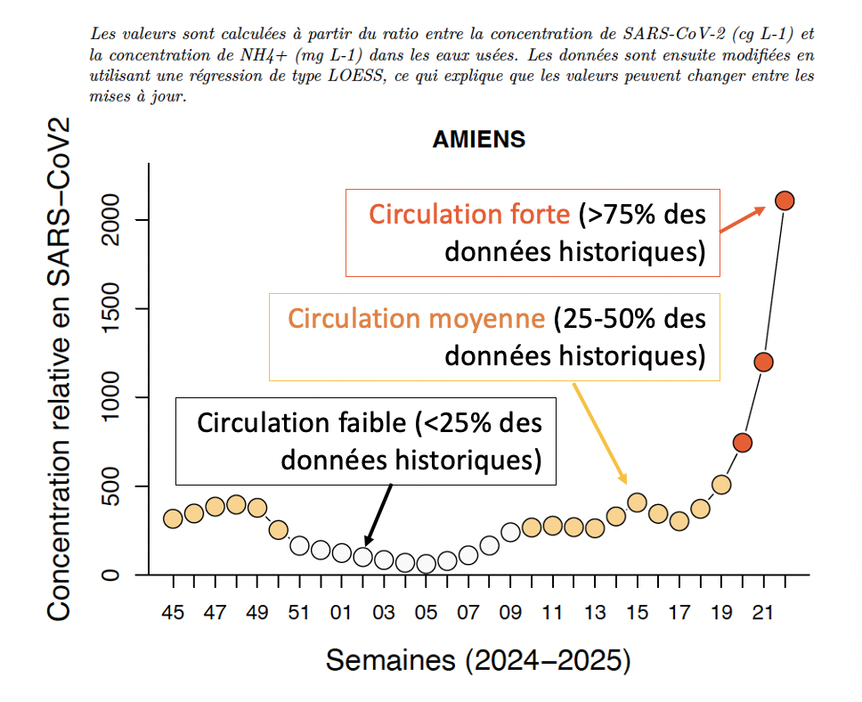
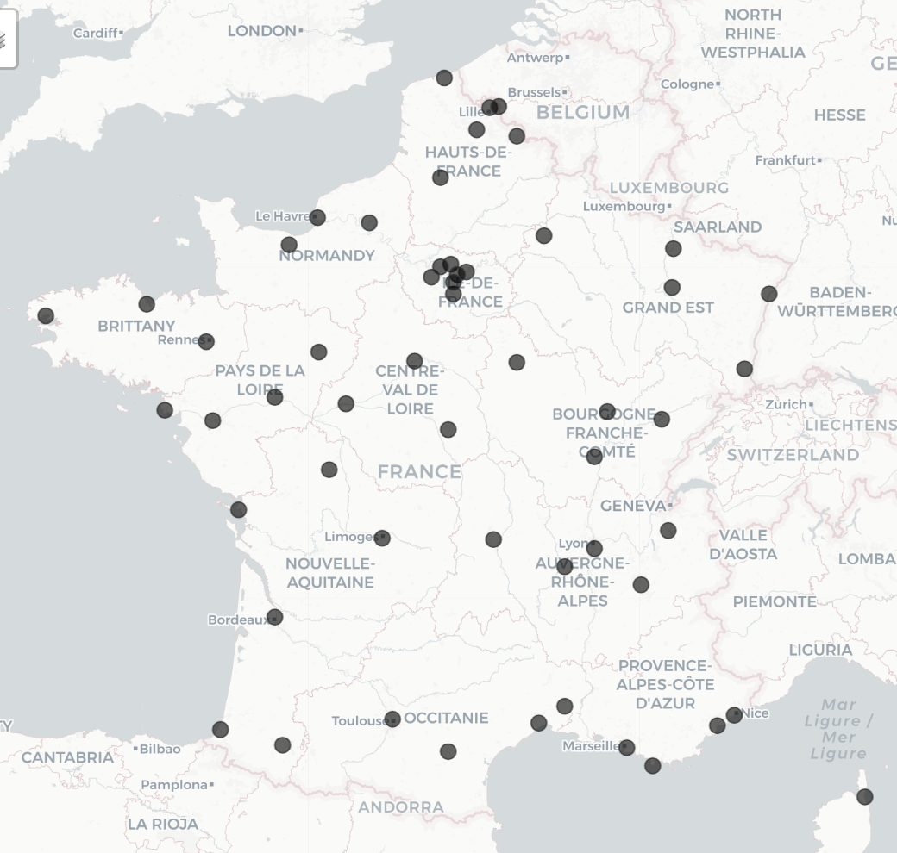

# Sum-Eau - France
(FRANCAIS)

**Suivi du SRAS-CoV2 dans les eaux usées hexagonales et Corses.**

Ces données présentent la surveillance du Sars-Cov-2 dans les eaux usées dans 54 collectivités.

Les données ouvertes et leur description se trouvent au lien suivant : https://www.data.gouv.fr/fr/datasets/surveillance-du-sars-cov-2-dans-les-eaux-usees-sumeau/

> *Les valeurs sont calculées à partir du ratio entre la concentration de SARS-CoV-2 (cg L-1) et la concentration de NH4+ (mg L-1) dans les eaux usées. Les données sont ensuite modifiées en utilisant une régression de type LOESS, ce qui explique que les valeurs peuvent changer entre les mises à jour.*

Fichiers disponibles (deux R markdown, un exemple de suivi et une carto)
- **Donnees-SumEau_colors.Rmd** (pour faire un pdf des villes par ordre alphabétique)
- **DonneesSumEau_2025_color_Région.Rmd** (pour faire un html par région avec sommaire cliquable, à publier [sur notre site](https://associationarra.wordpress.com/suivi-regional-sumeau/))
- **Un exemple de suivi avec son explication :**

- **Carte des stations d'eaux usées suivies par Sum'Eau :**

ENGLISH: Follow-up of French SARS-CoV2 concentration in waste waters.
